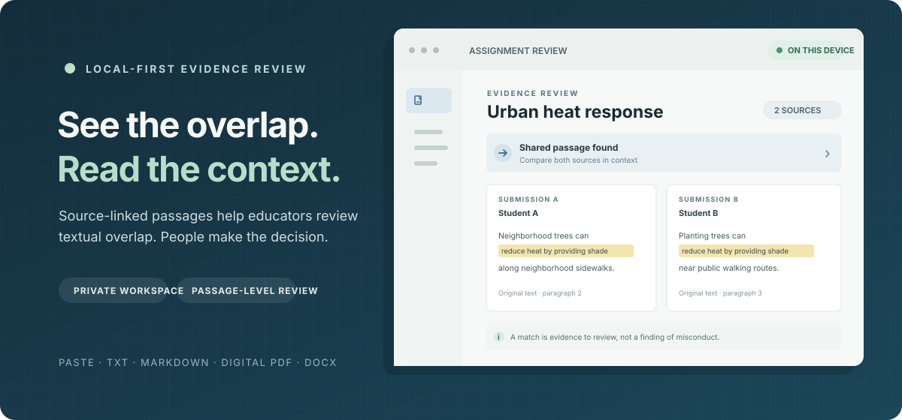

<div align="center">

# Provenance

### See the overlap. Review the context. Keep the decision human.

**A local-first desktop workspace for educators reviewing textual overlap in student submissions.**

[Product page](https://ranjeet-h.github.io/provenance/) ·
[Getting started](docs/GETTING_STARTED.md) ·
[Security](SECURITY.md) ·
[Proprietary license](LICENSE)

[](https://github.com/ranjeet-h/provenance/actions/workflows/pages.yml)

</div>

<p align="center">
  
</p>
<p align="center"><sub>Illustrative preview · synthetic sample text</sub></p>

Provenance compares the submissions and reference material you select, then
connects reported matches to their source passages. It gives educators a
clearer place to review evidence while leaving interpretation and decisions
with people.

> **Desktop preview:** build from source to try it. Public signed installers
> are not available yet.

## What you can do

- **Follow each match to its source.** Inspect exact and modified overlap in
  context, linked to the original submission passages.
- **Focus each comparison.** Exclude the assignment instructions and compare
  against the work and reference libraries you select.
- **Keep the assignment together.** Review pairwise and per-student evidence in
  one session workspace.
- **Carry review material forward.** Create self-check PDFs or signed reports
  for locked sessions, and export one or multiple sessions as `.plagpack`
  reference archives.

## A review in three steps

1. **Gather the work.** Create an assignment session, add the prompt, and paste
   or import student submissions.
2. **Read the matches.** Analyze the session, compare the overlap summary, and
   open matched passages beside their source text.
3. **Keep the record you need.** Export a self-check or certified report, or
   move selected session material as a `.plagpack` archive.

The comparison corpus is limited to what you add. Provenance does not search
the public web or determine intent or misconduct. A match is a prompt to review
the surrounding context—not a conclusion on its own.

## Supported files

| Input                              | Support                          |
| ---------------------------------- | -------------------------------- |
| Pasted text                        | Yes                              |
| UTF-8 TXT and Markdown             | Yes                              |
| Digital PDF                        | Yes, when the text is selectable |
| DOCX                               | Yes                              |
| Images and image-only/scanned PDFs | Not supported                    |

## Get started

Install Node.js, **pnpm 12.3.3**, stable Rust, and the [native Tauri
prerequisites](https://tauri.app/start/prerequisites/) for your operating
system. Then run:

```sh
git clone https://github.com/ranjeet-h/provenance.git
cd provenance
pnpm install --frozen-lockfile
pnpm --filter provenance-app tauri dev
```

See the [full setup and use guide](docs/GETTING_STARTED.md) for platform
dependencies, app bundles, session workflows, reports, and archive exchange.

## Privacy and review

Student submissions and comparison libraries stay in the local application
workspace. The app has no hosted analysis service or account sign-in. Exported
reports and `.plagpack` archives may contain sensitive assignment text—share
them only with intended recipients and protect your device and backups.

Self-check PDFs are marked **Not Teacher Certified**. A signed report records
the integrity of reviewed local inputs; it is not an institutional certificate.
Locking a session for certification is irreversible in the app.

## Run the checks

```sh
pnpm typecheck
pnpm lint
pnpm test
pnpm build
cargo fmt --check
cargo clippy --workspace --all-targets --all-features -- -D warnings
cargo test --workspace
```

Or run the complete sequence with `bash scripts/check-all.sh`. Rust build
artifacts are written to ignored `target/` directories and can use several GB
of disk space; avoid repeated clean builds.

The [`manual-test-pack`](manual-test-pack/README.md) contains synthetic
submissions for checking supported formats, analysis, reports, and
`.plagpack` round-trips.

<details>
<summary>Architecture</summary>

- `apps/app`: React, TypeScript, Vite, and the Tauri desktop shell.
- `crates/provenance-core`: digital-document import, local storage, and analysis
  orchestration.
- `crates/provenance-match`: deterministic exact and modified text matching.
- `crates/provenance-report`: PDF reports, signing, and `.plagpack` exchange.
- `packages/shared-types`: shared frontend/native command types.
- `site`: static product page deployed with GitHub Pages.

</details>

## Project links

- [Product page](https://ranjeet-h.github.io/provenance/)
- [Build and use guide](docs/GETTING_STARTED.md)
- [Manual test pack](manual-test-pack/README.md)
- [Security reporting](SECURITY.md)
- [Proprietary license and rights](LICENSE)

## License

Provenance is **proprietary software; all rights are reserved**. Public access
is provided for inspection and security review, not as a general reuse or
commercial license. GitHub's terms provide limited rights to view and fork
public repositories through GitHub; third-party components remain under their
own licenses. See [LICENSE](LICENSE) and [RIGHTS.md](RIGHTS.md).
